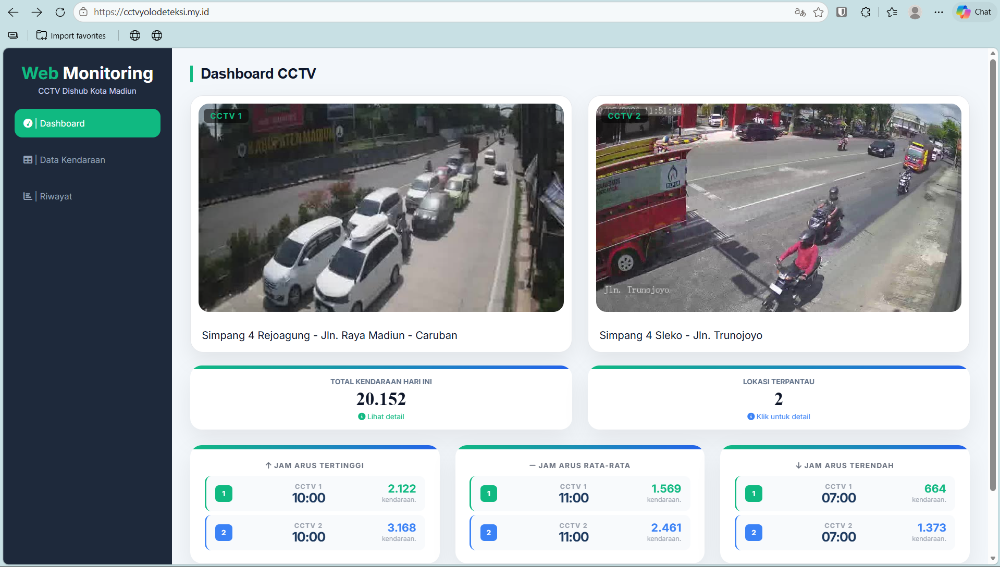
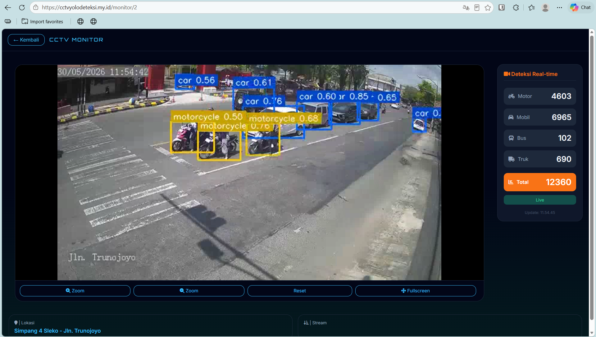
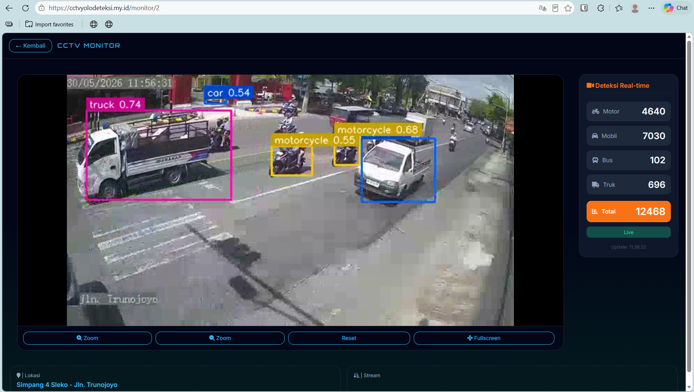
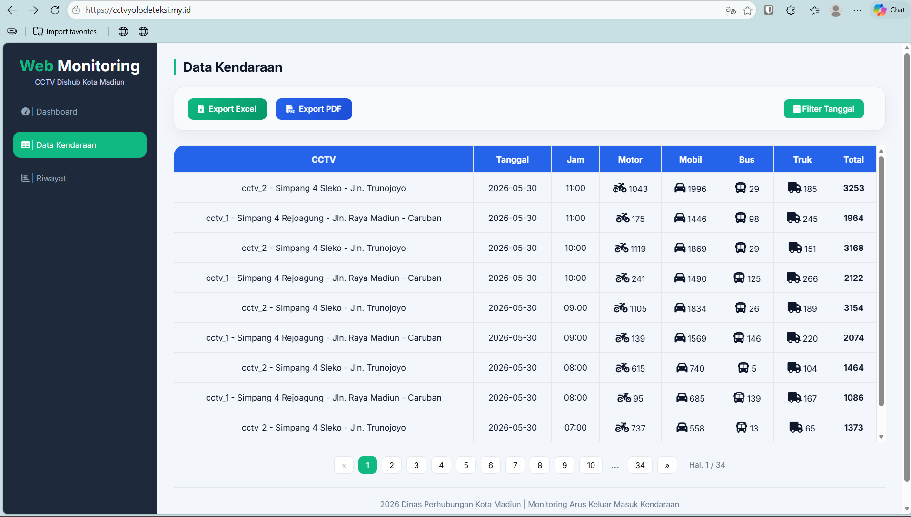
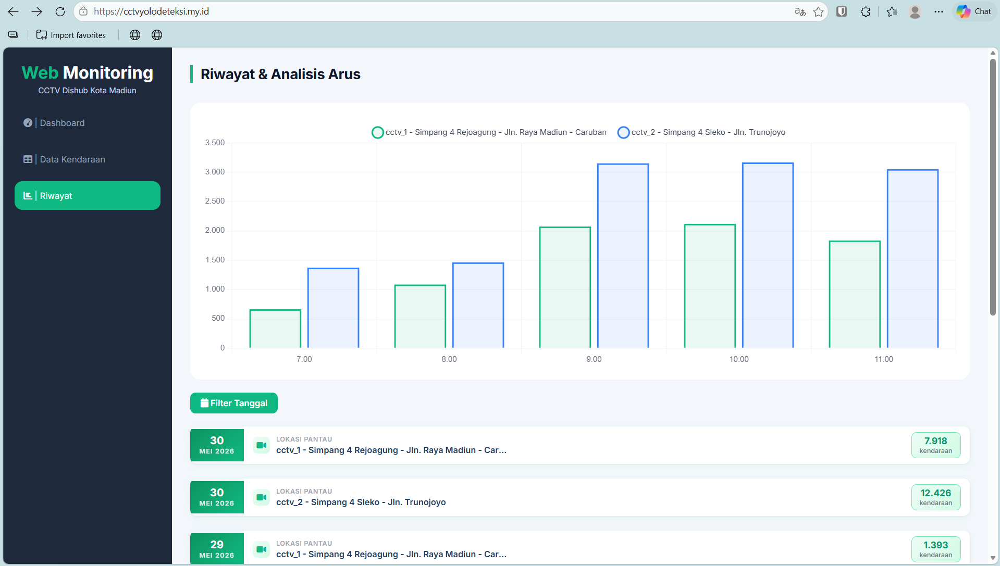

# CCTV DETEKSI ARUS LALU LINTAS (YOLO)

Sistem monitoring arus lalu lintas berbasis Computer Vision yang dikembangkan untuk membantu proses pemantauan kendaraan melalui kamera CCTV. Sistem ini menggunakan YOLOv8 untuk mendeteksi kendaraan, kemudian melakukan tracking dan counting berdasarkan kendaraan yang terpantau.

Project ini dikembangkan dalam rangka **Tugas Akhir Program Studi D3 Teknologi Informasi** dengan **Dinas Perhubungan Kota Madiun** sebagai mitra dalam penerapan dan pengembangan sistem.

Sistem menampilkan hasil pemantauan melalui dashboard berbasis web sehingga kondisi lalu lintas dapat dipantau dengan lebih mudah. Data kendaraan yang terdeteksi juga disimpan ke dalam database SQLite untuk digunakan sebagai riwayat dan bahan pengolahan data.

## Fitur Utama

- Deteksi kendaraan secara real-time melalui CCTV
- Deteksi berdasarkan jenis kendaraan
- Tracking kendaraan yang terdeteksi
- Counting jumlah kendaraan
- Monitoring beberapa sumber CCTV
- Dashboard monitoring berbasis web
- Penyimpanan data hasil deteksi
- Riwayat data kendaraan

## Jenis Kendaraan

Sistem dapat mendeteksi beberapa jenis kendaraan, yaitu:

- Motorcycle
- Car
- Bus
- Truck

## Teknologi yang Digunakan

- **Python** — proses deteksi dan pengolahan Computer Vision
- **YOLOv8** — deteksi kendaraan
- **ByteTrack** — tracking kendaraan
- **Node.js** — pengembangan aplikasi dan dashboard
- **JavaScript** — interaksi pada aplikasi web
- **HTML & CSS** — tampilan dashboard
- **SQLite** — penyimpanan data
- **FFmpeg** — pengolahan video dan streaming
- **RTSP** — sumber video dari CCTV
- **Git & GitHub** — pengelolaan source code

## Cara Kerja Sistem

Secara sederhana, sistem bekerja dengan mengambil video dari CCTV kemudian memprosesnya menggunakan model YOLOv8 untuk mendeteksi kendaraan.

Kendaraan yang berhasil terdeteksi kemudian dilacak menggunakan ByteTrack. Ketika kendaraan melewati area yang telah ditentukan, sistem akan mencatat dan menghitung kendaraan tersebut berdasarkan jenis dan arah pergerakannya.

Data hasil pemantauan kemudian disimpan ke SQLite dan ditampilkan pada dashboard web.

## Tampilan Sistem

### Dashboard



### Live CCTV



### Deteksi Kendaraan



### Data Kendaraan



### Riwayat Arus Lalu Lintas




## Install & Dependencies

- [DOWNLOAD PYTHON V3.10.11](https://www.python.org/downloads/release/python-31011/)
- [DOWNLOAD NODEJS V24.13.0](https://nodejs.org/en)
- [FFMPEG built with gcc 11.2.0](https://drive.google.com/file/d/1oY415KsA8uFA1KCFtyBY3jgXG0fZchOO/view?usp=drive_link)

## Dependencies

- nodejs
```bash
npm install || npm i
```

- python
```bash
pip install -r requirements.txt || python -m pip install -r requirements.txt
pip install torch==2.4.1 torchvision==0.19.1 --index-url https://download.pytorch.org/whl/cpu
```

## Run Project

- nodejs
```bash
npm run dev || npm run dev -- --max-old-space-size=2024
```

- python
```bash
python app.py || py app.py
```
